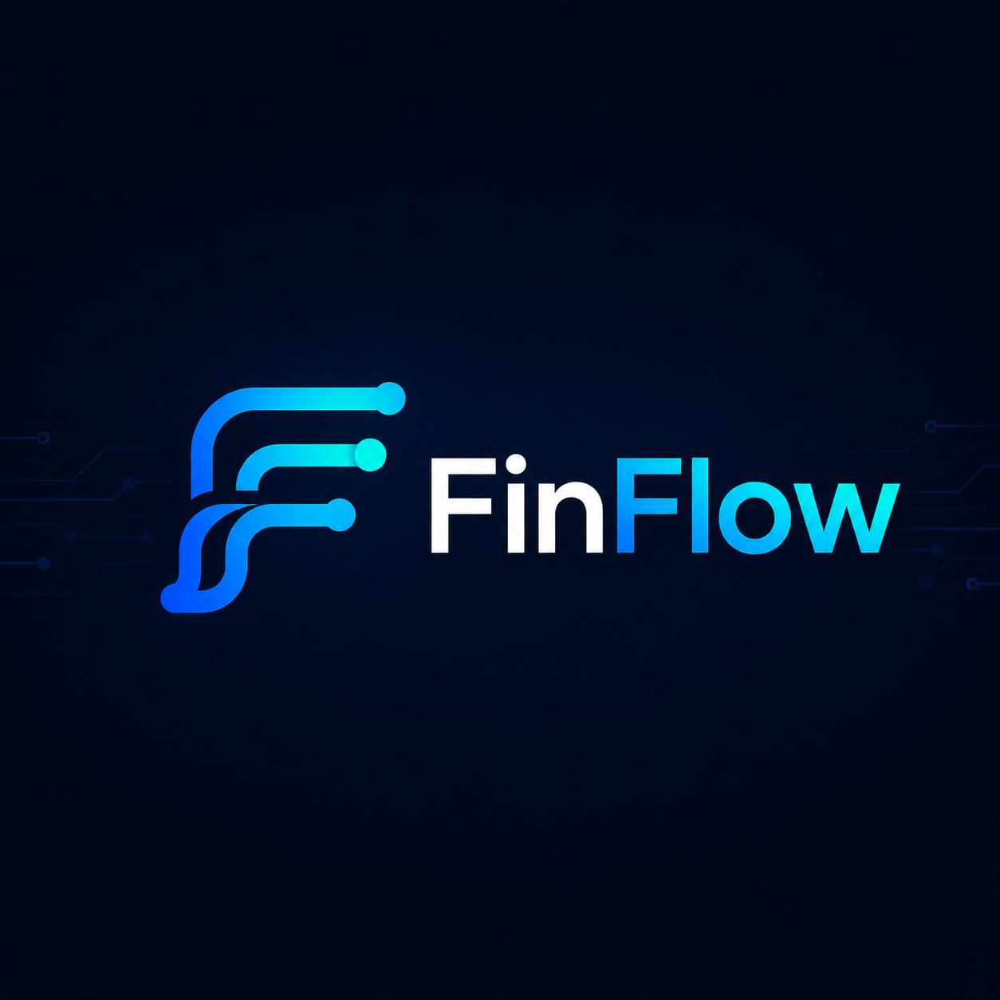
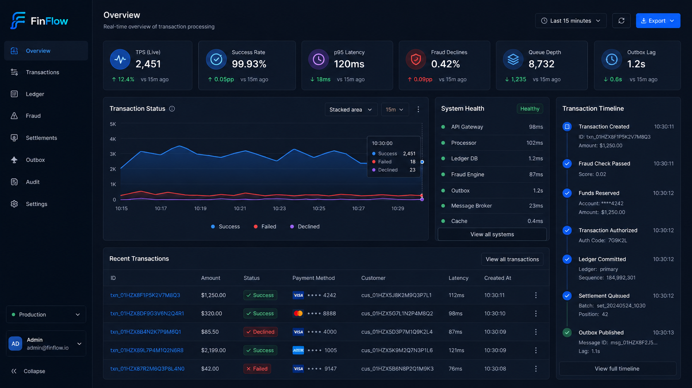

# FinFlow

<p align="center">
  
</p>

<p align="center">
  <strong>Universal transaction processing platform built with Go, .NET 10, PostgreSQL, RabbitMQ and Blazor.</strong>
</p>

<p align="center">
  <a href="#"></a>
  <a href="#"></a>
  <a href="#"></a>
  <a href="#"></a>
  <a href="#"></a>
  <a href="#"></a>
</p>

---

## Overview

**FinFlow** is a distributed transaction processing platform for financial-like operations.

It combines a high-performance **Go Gateway** with a domain-focused **.NET 10 backend** to process payments, transfers, refunds, withdrawals, reversals and settlements through a shared transaction pipeline.

The project focuses on reliability, consistency and observability:

- idempotent transaction processing;
- immutable double-entry ledger;
- fraud and limit checks;
- RabbitMQ-based event flow;
- transactional outbox/inbox patterns;
- Blazor operational dashboard;
- PostgreSQL as the source of truth;
- OpenTelemetry, Grafana and structured logs.

FinFlow is not a real payment provider.  
It is a production-inspired engineering project that demonstrates how transaction-heavy systems can be designed.

---

## Features

- **Universal transaction pipeline**  
  One processing flow for multiple operation types.

- **Go Gateway**  
  External API boundary, request validation, rate limiting, request signing and correlation propagation.

- **.NET 10 Domain Core**  
  Transaction orchestration, ledger posting, fraud rules, audit trail and background workers.

- **Immutable Ledger**  
  Append-only double-entry ledger for financial movements.

- **Idempotency**  
  Safe retries without duplicated money movement.

- **Transactional Outbox**  
  Database state and domain events are committed atomically.

- **Inbox Deduplication**  
  Consumers safely handle duplicated messages.

- **Blazor Admin UI**  
  Transaction timeline, ledger viewer, fraud decisions, outbox monitor and system health.

- **Observability Stack**  
  Metrics, logs and traces with Prometheus, Grafana, ELK/OpenSearch-compatible logging and OpenTelemetry.

- **Docker-first Runtime**  
  Runs locally without Kubernetes.

---

## Architecture

```text
Client
  │
  ▼
Go Gateway
  │
  ├─ request signing
  ├─ rate limiting
  ├─ idempotency pre-check
  └─ correlation id
  │
  ▼
.NET Transaction Core
  │
  ├─ state machine
  ├─ fraud checks
  ├─ limit checks
  ├─ ledger posting
  └─ outbox writing
  │
  ▼
PostgreSQL
  │
  ├─ transactions
  ├─ ledger entries
  ├─ audit log
  └─ outbox/inbox
  │
  ▼
RabbitMQ
  │
  └─ domain events
  │
  ▼
Read Models + Blazor Admin
  │
  ▼
Grafana / Logs / Traces
````

---

## Transaction Types

| Type            | Description                                               |
| --------------- | --------------------------------------------------------- |
| `Payment`       | Moves funds from a customer account to a merchant account |
| `Refund`        | Returns funds for a completed payment                     |
| `Transfer`      | Moves funds between internal accounts                     |
| `TopUp`         | Adds funds to an account                                  |
| `Withdrawal`    | Moves funds out of the platform                           |
| `Authorization` | Reserves funds without capturing them                     |
| `Capture`       | Finalizes a previous authorization                        |
| `Reversal`      | Compensates a previous transaction                        |
| `Adjustment`    | Manual audited balance correction                         |
| `Settlement`    | Groups completed transactions into a settlement batch     |

---

## Tech Stack

| Layer             | Technology                                                |
| ----------------- | --------------------------------------------------------- |
| Gateway           | Go                                                        |
| Backend           | .NET 10, ASP.NET Core                                     |
| UI                | Blazor                                                    |
| Database          | PostgreSQL                                                |
| Messaging         | RabbitMQ                                                  |
| Cache             | Redis                                                     |
| Secrets           | Vault                                                     |
| Observability     | OpenTelemetry, Prometheus, Grafana, ELK/OpenSearch        |
| Runtime           | Docker Compose                                            |
| Dev Orchestration | .NET Aspire                                               |
| Testing           | Unit tests, integration tests, contract tests, load tests |

---

## Quick Start

### Prerequisites

* Docker
* Docker Compose
* Go
* .NET 10 SDK

### Clone

```bash
git clone https://github.com/your-name/finflow.git
cd finflow
```

### Start

```bash
docker compose up -d
```

### Open

```text
Gateway API:   http://localhost:8080
Admin UI:      http://localhost:5000
Grafana:       http://localhost:3000
RabbitMQ UI:   http://localhost:15672
```

---

## Example Request

```bash
curl -X POST http://localhost:8080/api/v1/transactions \
  -H "Content-Type: application/json" \
  -H "X-Client-Id: demo-client" \
  -H "X-Request-Signature: sha256=demo" \
  -H "Idempotency-Key: demo-payment-001" \
  -d '{
    "type": "Payment",
    "amount": "150.00",
    "currency": "USD",
    "sourceAccountId": "acc_customer_001",
    "destinationAccountId": "acc_merchant_001",
    "metadata": {
      "orderId": "ord_10001"
    }
  }'
```

Example response:

```json
{
  "transactionId": "txn_01HX8J7K9M",
  "type": "Payment",
  "status": "Succeeded",
  "amount": "150.00",
  "currency": "USD",
  "correlationId": "corr_01HX8J7K9M",
  "createdAt": "2026-05-08T10:15:30Z"
}
```

---

## Admin UI

<p align="center">
  
</p>

The Admin UI provides an operational view of the platform:

* transaction list;
* transaction details;
* processing timeline;
* ledger entries;
* fraud decisions;
* audit log;
* outbox state;
* system health;
* real-time transaction updates.

---

## Observability

FinFlow uses correlation-first observability.

Every request receives a `CorrelationId` that is propagated across:

```text
Gateway → Transaction Service → Ledger → Outbox → RabbitMQ → Consumers → Admin UI
```

The platform exposes:

* HTTP metrics;
* transaction latency;
* success and decline rates;
* fraud decision metrics;
* outbox lag;
* RabbitMQ queue depth;
* PostgreSQL health;
* structured logs;
* distributed traces.

---

## Project Structure

```text
finflow/
  src/
    gateway/              Go gateway
    services/             .NET backend services
    admin/                Blazor Admin UI
    shared/               shared contracts and infrastructure
    apphost/              Aspire AppHost

  tests/
    unit/
    integration/
    contract/
    load/

  deploy/
    docker-compose.yml
    grafana/
    prometheus/
    rabbitmq/
    postgres/
    vault/

  docs/
    PRD.md
    ADR/
    API/
    EVENTS/
    RUNBOOKS/
```

---

## Documentation

| Document                         | Description                          |
| -------------------------------- | ------------------------------------ |
| [`docs/PRD.md`](docs/PRD.md)     | Product requirements and scope       |
| [`docs/ADR`](docs/ADR)           | Architecture decisions               |
| [`docs/API`](docs/API)           | API contracts                        |
| [`docs/EVENTS`](docs/EVENTS)     | Domain event contracts               |
| [`docs/RUNBOOKS`](docs/RUNBOOKS) | Failure scenarios and recovery notes |

---

## Roadmap

* [ ] Go Gateway
* [ ] .NET Transaction Service
* [ ] PostgreSQL schema and migrations
* [ ] Idempotency support
* [ ] Ledger Service
* [ ] RabbitMQ outbox publisher
* [ ] Inbox deduplication
* [ ] Fraud Service
* [ ] Blazor Admin UI
* [ ] Grafana dashboards
* [ ] OpenTelemetry tracing
* [ ] Load testing
* [ ] Vault integration
* [ ] Settlement workflow
* [ ] Reversal and adjustment workflows

---

## Design Principles

```text
Correctness before throughput.
Ledger before dashboard.
Events after commit.
No business logic in the gateway.
No hidden state transitions.
No untraceable transaction.
```

---

## License

MIT
